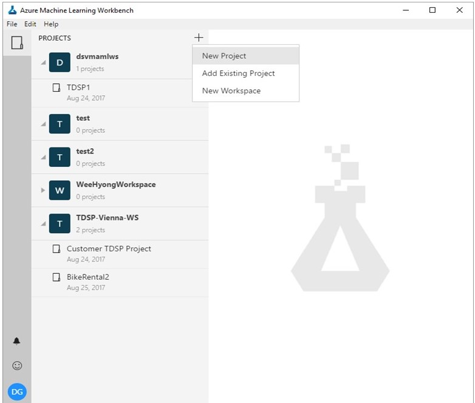
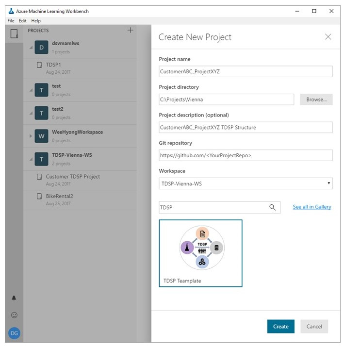

# Instructions on how to instantiate and use TDSP in Vienna

This document provides the instructions on how to instantiate and use Team Data Science Process (TDSP) project structure and templates in Vienna. 

### First, what is TDSP and why should you use TDSP structure and templates in Vienna?
[TDSP](https://github.com/Azure/Microsoft-TDSP) is an agile, iterative, data science process for executing and delivering advanced analytics solutions. It is designed to improve collaboration and efficiency of data science teams in enterprise organizations. It is supported through four key components:
1. a standard data science lifecycle definition [[link]](https://github.com/Azure/Microsoft-TDSP/blob/master/Docs/lifecycle-detail.md)
2. a standardized project structure (project documentation and reporting templates) [[link]](https://github.com/Azure/Azure-TDSP-ProjectTemplate)
3. infrastructure for project execution (compute and storage infrastructure, code repositories, etc.)
4. tools for data science project tasks (collaborative version control and code review, data exploration and modeling, work planning. etc.)

Standardization of data science projects and their artifacts is an important goal and deliverable of TDSP. To that end, we had previously released a [GitHub repository for the TDSP project structure and templates](https://github.com/Azure/Azure-TDSP-ProjectTemplate). To date, it was not possible to instantiate the TDSP structure and templates within a data science tool. To address this issue, and facilitate easy instantiation of TDSP structure and documentation templates, we have now enabled TDSP instantiation in Vienna. This will provide the benefits of standardization of data science projects in terms of structure and documentation to a data science team that is using Vienna.

### Instantiating TDSP strucute and templates from Vienna template gallery
Once you open the Vienna application, the following are the step-by-step instructions that you need to take to create a new project using TDSP structure, having TDSP documentation templates:

#### Start creation of a new project using the '+' sign at top left.
Under Projects on top left, click on "+" to create a new project.

 

#### Fill in project information (Names, Git repo location, local folder location etc.)
While creating the new project, on the form please specify all the parameters and information in the relevant boxes, e.g. project name, directory, Git repo location, Workspace where you want the projet to be created etc. Then in the Search box, type in "TDSP". The "TDSP Template" will show up. Click and select that template. Then hit "Create" to create your new project in TDSP structure.

 

#### Examine the TDSP project structure
After your new project is created (usually in a few seconds), examine its structure. This structure is derived from the TDSP structure published [here](https://github.com/Azure/Azure-TDSP-ProjectTemplate), with some simplifications. For example, several of the document templates are merged into one markdown, namely, [ProjectReport.md](../ProjectReport.md). Note however, that all the aspects of standardized documentation for business understanding, the stages of the TDSP lifecyle, data location, definition, and architecture are contained in this documentation template.

 

### Using the TDSP structure and templates

The template is not populated with any code, you will obverve, in the Code folder (and sub-folders). You are expected to populate the Code folder and its sub-folders with code files that are necessary for executing your project. The [ProjectReport.md](../ProjectReport.md) is a template that should be directly modified with information relevant to your project. The ProjectReport.md comes with a set of questions which help you to fill out the information on all four stages of the [Data Science Life Cycle](https://github.com/Azure/Microsoft-TDSP/blob/master/Docs/lifecycle-detail.md).

### Documenting your project
Refer to [TDSP doumentation templates](https://github.com/Azure/Azure-TDSP-ProjectTemplate) to see how you can document your project for efficient collaboration and reproducibility. In the current Vienna TDSP documentation template, we recommend that you include all the information in the [ProjectReport](../ProjectReport.md) file. This template needs to be filled out with information that is specific to your project. 

In addition to the [ProjectReport](../ProjectReport.md), which serves as the primary project document, we provide another template, [ProjectLearnings](./ProjectLearnings.md), to include any learnings and information, which may not be included in the primary project document, but still useful to document. 

### Example end-to-end worked-out projects done using TDSP in Vienna

To facilitate your understanding on how the TDSP structure and templates can be used in actual projects, we will provide several end-to-end worked-out project examples executed using Vienna. Links to these are provided below:
1. Using biomedical for named entity recognition using deep learning (link to come)
