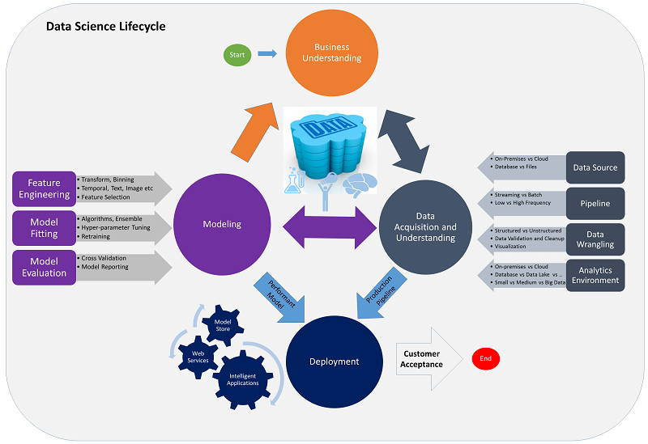

# Team Data Science Process from Microsoft

This repository contains the **Vienna** instantiation of the [**Team Data Science Process (TDSP) from Microsoft**](https://github.com/Azure/Microsoft-TDSP). 
TDSP is an agile, iterative, data science methodology to improve collaboration and team learning. It is supported through a lifecycle definition, standard project structure, artifact templates, and tools for productive data science. 

You can make minor modifications to the documentation temlates provided here and execute your project, and prepare the Data Science deliverables for your client or customer.

## Information about TDSP in Vienna
When you instantiate TDSP from Vienna, you get the TDSP-recommended standardized directory structure, and document templates for project execution and delivery. The final delivery report to the customer or client is named FinalDeliverable.md. 

## Team Data Science Process Lifecycle 
You can use the TDSP recommended lifecycle to structure your data science projects. Basically, the lifecycle defines the steps that projects executing using the TDSP follow from start to finish. If you are using another lifecycle such as [CRISP-DM](https://wikipedia.org/wiki/Cross_Industry_Standard_Process_for_Data_Mining), [KDD](https://wikipedia.org/wiki/Data_mining#Process) or your own custom process that is working well in your organization, you can still use TDSP in the context of those development lifecycles. It is to be noted that this lifecycle is in the context of data science projects that lead to building data products and intelligent applications that include predictive analytics using machine learning or artificial intelligence (AI) models that are productionized. Exploratory data science projects and adhoc / on-off analytics projects can use this process but some steps of this lifecycle may not be needed.    

Here is a depiction of the TDSP lifecycle. 

 

The TDSP data science lifecycle is composed of four major stages that are executed iteratively. This includes:

* Business Understanding
* Data Acquisition and Understanding
* Modeling
* Deployment

The above should ideally be followed by customer acceptance

## Project planning and execution
If you would like to follow [Visual Studio Online (Team Services)](https://azure.microsoft.com/en-us/services/visual-studio-team-services/) for planning, management and execution of your Data Science projects, detailed instructions are provided [here](https://github.com/Azure/Microsoft-TDSP/blob/master/Docs/team-data-science-process-project-execution.md).

## Release Notes

This is an **early preview (Sept 2016)** release of [TDSP](https://github.com/Azure/Microsoft-TDSP). We are continuously improving TDSP based on our further accumulated experience, and customer feedback. Stay tuned for future releases. 

## Ask Questions. 

We would love to hear back from you. Should you have any questions or suggestions, please create a new discussion thread on the [Issues Tab](https://github.com/Azure/Microsoft-TDSP/issues).

