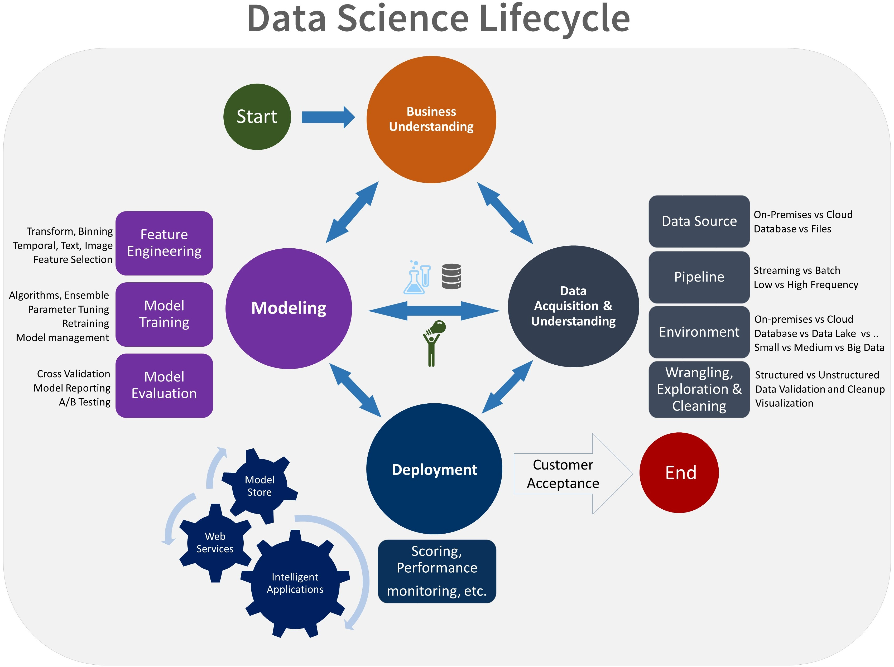

# Team Data Science Process from Microsoft

This repository contains an instantiation of the [**Team Data Science Process (TDSP) from Microsoft**](https://github.com/Azure/Microsoft-TDSP) for project **Vienna**. The TDSP is an agile, iterative, data science methodology designed to improve team collaboration and learning. It facilitates better coordinated and more productive data science enterprises by providing:

- a lifecycle that defines the steps in project development
- a standard project structure
- artifact templates for reporting
- tools to assist with data science tasks

## Information about TDSP in Vienna
When you instantiate the TDSP from Vienna, you get the TDSP-recommended standardized directory structure and document templates for project execution and delivery. The workflow then consists of the following steps:

- modify the documentation templates provided here for your project
- execute your project
- prepare the Data Science deliverables for your client or customer, including the FinalDeliverable.md report.

We provide [instructions on how to instantiate and use TDSP in Vienna](https://github.com/hning86/ViennaSample-TDSP/blob/master/Using-TDSP-in-Vienna.md).

## Team Data Science Process Lifecycle 
TDSP uses the data science lifecycle to structure projects. The lifecycle defines the steps that a project typically must execute, from start to finish. This lifecycle is valid for data science projects that build data products and intelligent applications that include predictive analytics. The goal is to incorporate machine learning or artificial intelligence (AI) models into commercial products. Exploratory data science projects or ad hoc/on-off analytics projects can also use this process, but in this case some steps of this lifecycle may not be needed.    

Here is a depiction of the TDSP lifecycle. 

 

The TDSP data science lifecycle is composed of four major stages that are executed iteratively. This includes:

* Business Understanding
* Data Acquisition and Understanding
* Modeling
* Deployment

These stages should, ideally, be followed by customer acceptance for successful projects. 

If you are using a different lifecycle schema, such as [CRISP-DM](https://wikipedia.org/wiki/Cross_Industry_Standard_Process_for_Data_Mining), [KDD](https://wikipedia.org/wiki/Data_mining#Process) or your own custom process that is working well in your organization, you can still use the TDSP in the context of those development lifecycles. 

For reference, see a more [detailed description of the TDSP life-cycle](https://github.com/Azure/Microsoft-TDSP/blob/master/Docs/team-data-science-process-lifecycle-detail.md). That version also provides additional documentation templates that are associated with each phase of the TDSP lifecycle.

## Project planning and execution
To deploy [Visual Studio Online (Team Services)](https://azure.microsoft.com/en-us/services/visual-studio-team-services/) for planning, managing and executing your data science projects, detailed instructions are provided [here](https://github.com/Azure/Microsoft-TDSP/blob/master/Docs/team-data-science-process-project-execution.md).

## Release Notes
This is an **early preview (Sept 2016)** release of [TDSP](https://github.com/Azure/Microsoft-TDSP). We are continuously improving TDSP based on customer experience and feedback. Stay tuned for future releases. 

## Ask Questions. 
We would love to hear back from your own experience with the TDSP. Should you have any questions or suggestions, please create a new discussion thread on the [Issues Tab](https://github.com/Azure/Microsoft-TDSP/issues).

